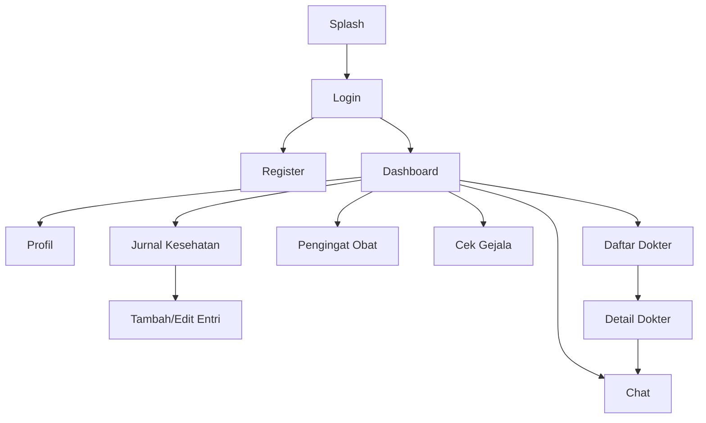

# Telehealth — Remote Monitoring App

Aplikasi mobile Flutter untuk **pemantauan kesehatan jarak jauh** bagi pasien, dengan
fitur jurnal kesehatan, pengingat obat, cek gejala, dan konsultasi (chat) dengan dokter.

---

## 1. Fitur Utama

| Fitur | Halaman | Deskripsi |
|---|---|---|
| Splash | `SplashScreen` | Native Android splash + splash Flutter (animasi logo), lalu masuk Login. |
| Autentikasi | `LoginPage`, `RegisterPage` | Login/daftar demo (validasi format, tanpa backend). |
| Beranda | `DashboardPage` | Metrik kesehatan, aksi cepat, jadwal konsultasi. |
| Jurnal Kesehatan | `HealthJournalPage`, `AddJournalEntryPage` | CRUD catatan (tekanan darah, gula darah, berat badan, dll). |
| Pengingat Obat | `MedicationReminderPage` | CRUD obat + penjadwalan & tandai "sudah diminum". |
| Cek Gejala | `SymptomCheckerPage` | Analisis gejala bertahap (area, gejala, tingkat keparahan) → rekomendasi tingkat urgensi. |
| Daftar Dokter | `DoctorListPage`, `DoctorDetailPage` | Daftar dokter, filter spesialisasi, profil dokter. |
| Chat | `ConversationListPage` | Daftar percakapan dengan dokter/keluarga. |
| Profil | `ProfilePage` | Info pengguna (dapat diedit) & preferensi. |

---

## 2. Teknologi & Arsitektur

- **Flutter (stable)**, Dart SDK `^3.10.4`
- **Android**: AGP 8.11.1, Gradle 8.14, Kotlin 2.2.20
- **Routing**: Named Routes pada `MaterialApp` (lihat `lib/app.dart`)
- **Pola**: Repository (singleton) + data dummy di memori; helper `SimulatedApi`
  mensimulasikan jeda jaringan dan kegagalan.

```
lib/
├── main.dart                     # entry point
├── app.dart                      # TelehealthApp + daftar route
├── core/
│   ├── theme/app_theme.dart      # tema Material 3 (seedColor #2196F3)
│   └── widgets/                  # app_dialogs, async_state (loading/error/empty)
├── data/
│   ├── models/                   # Doctor, JournalEntry, Medication, Conversation, Appointment
│   └── repositories/             # Doctor/Journal/Medication/Conversation + simulated_api
└── features/                     # auth, dashboard, health_journal, medication,
                                  # symptom_checker, doctor, chat, profile
```

---

## 3. Persyaratan (Prerequisites)

- Flutter SDK **stable** (disarankan versi terbaru)
- Dart `>= 3.10.x`
- Android Studio / VS Code + Android SDK (untuk build Android)
- Emulator Android atau perangkat fisik (disarankan **Android 12+** untuk melihat
  native splash versi baru)

Cek versi:
```bash
flutter --version
flutter doctor
```

> **Windows:** aktifkan **Developer Mode** (`start ms-settings:developers`) agar
> Flutter dapat membuat symlink plugin saat `pub get`/build. Tanpanya, `pub get`
> akan gagal dengan pesan *"Building with plugins requires symlink support"*.

---

## 4. Setup

```bash
# 1. Masuk ke folder project
cd Telehealth_ItuDia

# 2. Ambil dependency
flutter pub get

# 3. (opsional, bila ada masalah cache) bersihkan lalu ambil ulang
flutter clean
flutter pub get
```

---

## 5. Perintah Menjalankan

```bash
# Lihat daftar device/emulator
flutter devices

# Jalankan di Android (emulator/perangkat)
flutter run

# Jalankan langsung ke device tertentu
flutter run -d <device_id>

# Build APK (debug / release)
flutter build apk --debug
flutter build apk --release
# Hasil: build/app/outputs/flutter-apk/

# Menjalankan seluruh pengujian otomatis
flutter test
```

---

## 6. Akun Demo & Data Dummy

**Login** menerima input apa pun yang formatnya valid (email berpola benar + password
terisi). Contoh: email `demo@telehealth.app`, password `123456`.

Data dummy yang tersedia (di memori, tidak persisten antar-restart):

| Data | Jumlah | Sumber | Catatan |
|---|---|---|---|
| Dokter | 8 (`doc1`–`doc8`) | `DoctorRepository` | 7 spesialisasi unik; sebagian `available: false` |
| Obat | 6 (`med1`–`med6`) | `MedicationRepository` | punya jadwal Pagi/Siang/Malam + relasi `doctorId` |
| Kategori jurnal | 5 (`cat1`–`cat5`) | `JournalRepository` | Tekanan Darah, Gula Darah, Berat Badan, Suhu, Detak Jantung |
| Entri jurnal | 21 awal | `JournalRepository` | 7 tensi + 7 gula darah + 7 berat badan |
| Percakapan | 6 (`conv1`–`conv6`) | `ConversationRepository` | dokter & keluarga, sebagian `unreadCount > 0` |
| Jadwal konsultasi | 2 (`apt1`, `apt2`) | `DashboardPage` | menghubungkan ke `doctorId` |

Semua repository memakai `SimulatedApi.run(...)` dengan **jeda 600 ms** supaya indikator
loading terlihat.

---

## 7. Skenario Simulasi (untuk Demo)

1. **Loading buatan** — setiap pemuatan data menunggu `SimulatedApi.delay` (600 ms),
   memunculkan state *loading* sebelum data tampil.
2. **Simulasi gagal** — repository menerima flag `simulateError: true`, yang melempar
   `SimulatedFailure` dan menampilkan state *error* + tombol coba lagi (via `AsyncState`).
   Cocok untuk menunjukkan penanganan error.
3. **CRUD in-memory** — tambah/ubah/hapus data obat & jurnal; perubahan bertahan selama
   sesi aplikasi berjalan (reset saat restart).
4. **Relasi antar-entitas** — pengingat obat terhubung ke dokter (`doctorId`) dan entri
   jurnal terhubung ke kategori (`categoryId`); ditampilkan pada UI dan diverifikasi uji.
5. **Splash berlapis** — native Android splash (logo + warna, tanpa teks) → splash
   Flutter (animasi) → Login.

---

## 8. Dokumen Ringkas

### 8.1 Persona

| Persona | Peran | Kebutuhan utama |
|---|---|---|
| **ItuDia** (pasien) | Pengguna utama | Mencatat kondisi harian, mengingat jadwal obat, berkonsultasi tanpa harus datang ke klinik. |
| **Dokter** (mis. dr. Rifki) | Tenaga medis | Melihat ringkasan kondisi pasien dan berkomunikasi via chat. |
| **Keluarga** (mis. Budi/Rina) | Pendamping | Memantau dan mengingatkan pasien. |

### 8.2 Peta Layar (Screen Map)



Route yang terdaftar di `lib/app.dart`:
`/` (Splash) · `/login` · `/register` · `/profile` · `/dashboard` · `/journal` ·
`/journal/add` · `/symptom-checker` · `/doctors` · `/chat` · `/medication`.
`DoctorDetailPage` dibuka dari daftar dokter (bukan named route).

### 8.3 Model Data

| Model | Field inti | Relasi |
|---|---|---|
| `Doctor` | id, name, specialization, experience, rating, price, available, hospital, bio, education | referensi untuk `Medication.doctorId` & `Appointment.doctorId` |
| `JournalCategory` | id, name, unit, isPressure | referensi untuk `JournalEntry.categoryId` |
| `JournalEntry` | id, categoryId, value, date, status, systolic, diastolic, note | → `JournalCategory` |
| `Medication` | id, name, dose, frequency, startDate, endDate, note, doctorId, schedules | → `Doctor` |
| `MedicationSchedule` | time, hour, taken | anak dari `Medication` |
| `Conversation` | id, name, role, type, lastMessage, time, unreadCount, isOnline, initials, color | — |
| `Appointment` | id, doctorId, doctorName, specialization, date, time | → `Doctor` |

### 8.4 Pembagian Kontribusi

> Ganti placeholder dengan nama anggota kelompok sebelum mengumpulkan.

| No | Anggota | Kontribusi |
|---|---|---|
| 1 | `Rifky Al Sauqy` | Pengingat obat, list dokter, detail dokter, chat, repository |
| 2 | `Yehezkiel Gustav Setiawan Sitanggang` | dashboard, jurnal kesehatan, tambah jurnal kesehatan, cek gejala, models |
| 3 | `Muhammad Farhan Prasetyo` | splash, autentikasi(login, register), profile, core(widget & theme), icon |

---

## 9. Matriks Pengujian (26 kasus, semua LULUS)

Dijalankan dengan `flutter test`. Hasil terakhir: **`All tests passed!` (+26)**.

| ID | Modul | Skenario | Hasil yang diharapkan | Status |
|---|---|---|---|---|
| T01 | Model `Doctor` | Inisialisasi dari nama | `initials` = `AF` | Lulus |
| T02 | Model `Doctor` | `copyWith` mengubah field | `id` tetap, field lain berubah | Lulus |
| T03 | Model `Medication` | hitung jadwal | `totalSchedules`=2, `takenSchedules`=1 | Lulus |
| T04 | Model `Medication` | `copyWith` | `id` dipertahankan | Lulus |
| T05 | Model `JournalEntry` | `copyWith` | `id` & `categoryId` tetap | Lulus |
| T06 | `DoctorRepository` | muat daftar dokter | tidak kosong | Lulus |
| T07 | `DoctorRepository` | data referensi spesialisasi | ≥ 5 | Lulus |
| T08 | `DoctorRepository` | `findById` relasi valid | mengembalikan dokter sesuai id | Lulus |
| T09 | `DoctorRepository` | `findById` id tidak dikenal | `null` | Lulus |
| T10 | `MedicationRepository` | muat data obat | tidak kosong | Lulus |
| T11 | `MedicationRepository` | `create` | jumlah data +1 | Lulus |
| T12 | `MedicationRepository` | `update` | tidak menambah data, field berubah | Lulus |
| T13 | `MedicationRepository` | `delete` | jumlah data −1 | Lulus |
| T14 | `MedicationRepository` | `toggleTaken` | status jadwal terbalik | Lulus |
| T15 | `JournalRepository` | kategori referensi | ≥ 5 | Lulus |
| T16 | `JournalRepository` | jumlah record utama | ≥ 20 | Lulus |
| T17 | `JournalRepository` | integritas relasi | semua `categoryId` valid | Lulus |
| T18 | `JournalRepository` | create/update/delete | berjalan berurutan | Lulus |
| T19 | `JournalRepository` | `fetchByCategory` | hanya entri kategori tersebut | Lulus |
| T20 | `ConversationRepository` | muat percakapan | tidak kosong | Lulus |
| T21 | `ConversationRepository` | `delete` | jumlah −1 | Lulus |
| T22 | `SimulatedApi` | mode error | melempar `SimulatedFailure` | Lulus |
| T23 | `SimulatedApi` | mode normal | mengembalikan nilai | Lulus |
| T24 | Widget | buka aplikasi | splash menampilkan teks `Telehealth` | Lulus |
| T25 | Widget | render login | halaman tampil + tombol "Masuk" | Lulus |
| T26 | Widget | login field kosong | tidak berpindah halaman (validasi) | Lulus |

**Bukti:** jalankan `flutter test` → keluaran ringkas:
```
00:30 +26: All tests passed!
```

### 9.1 Bukti Perbaikan (Bug Fix Log)

Selain pengujian, berikut perbaikan nyata yang dilakukan selama pengembangan:

| # | Masalah | Perbaikan | Bukti |
|---|---|---|---|
| F1 | Import `package:telehealth_app/...` tidak resolve setelah nama aplikasi diganti | Semua import diselaraskan ke `package:Telehealth/...` | `flutter analyze` tanpa error impor |
| F2 | Splash ganda (native lama + Flutter) tampak "berkedip" | Native splash disamakan warna & logo dengan splash `.dart` (`#36618E`) | `flutter build apk --debug` sukses |
| F3 | Ikon native splash terlihat terlalu besar di Android 12+ | Ikon diberi padding (scale 0.6) via `splash_icon.xml` | build sukses |
| F4 | Sudut bulatan splash native terpotong mask Android 12 | Bentuk putih diubah jadi lingkaran | build sukses |
| F5 | App icon masih logo Flutter default | App icon dibuat dari logo splash yang sama (adaptive icon) | build sukses |
| F6 | Integritas relasi data dummy | Ditambahkan uji relasi (T08, T17, T19) | test Lulus |

---

## 10. Troubleshooting

| Masalah | Penyebab | Solusi |
|---|---|---|
| `pub get` gagal: *requires symlink support* | Windows Developer Mode nonaktif | Aktifkan Developer Mode, atau jalankan terminal sebagai admin |
| Icon/nama app masih lama di launcher | Cache launcher | Uninstall lalu install ulang; atau clear cache launcher + restart |
| Native splash tampak berbeda sudut/ukuran (Android 12+) | Mask ikon splash bersifat lingkaran di Android 12+ | Sudah ditangani (`splash_icon.xml` berbentuk lingkaran, di-scale) |
| Data hilang setelah restart | Data dummy disimpan di memori | Sesuai desain demo; tidak persisten |

---

## 11. Struktur Pengujian

```
test/
├── models_test.dart        # 5 uji model
├── repositories_test.dart  # 18 uji repository & SimulatedApi
└── widget_test.dart        # 3 uji widget (splash & login)
```

Jalankan: `flutter test`